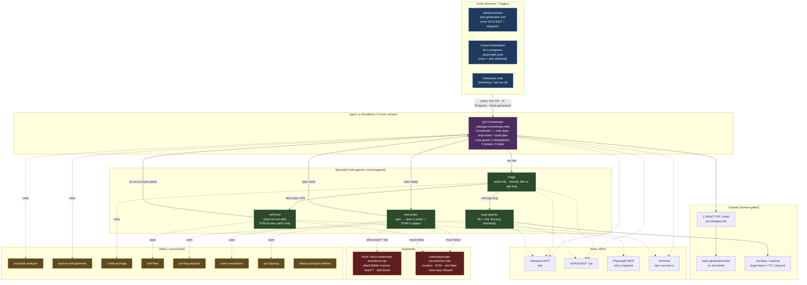

# QA Automation Harness

How the orchestrator, sub-agents, skills, guardrails, and tools fit together.

## Legend

- **Triggers → Orchestrator** — a run starts via the GHA workflow (`test-generation.yml`), the Cursor Automation, or interactive chat. The outer runner queries Jira (`DS · In Progress · !tests-generated`) and hands ticket keys in; the orchestrator never decides when to start.
- **Orchestrator (`qa-orchestrator.mdc`)** — the coordinator. It only reads the ticket and produces the plan, then delegates. Loop guards cap it at 3 delegations, 5 tickets/run, 5 heals/run.
- **Sub-agents (`.cursor/agents/`)** — `test-writer` (plan → spec + POM), `triage` (read-only classify), `bug-reporter` (file Jira bug). `self-heal` is the registered heal-on-red **skill** (drawn in the agent lane as a delegated actor) and is **not** invoked in scheduled backlog runs.
- **Skills** — feed knowledge/behavior into each actor.
- **Guardrails** — the `block-weakened-assertions` hook (fails closed on `tests/**` edits) and the conventions rule's hard-stop refusals (never weaken assertions, never heal a real bug, no CSS/XPath, etc.).
- **Outputs** — human-gated: DRAFT PRs, the `tests-generated` label, and filed bugs. Never merges or ticket transitions.
